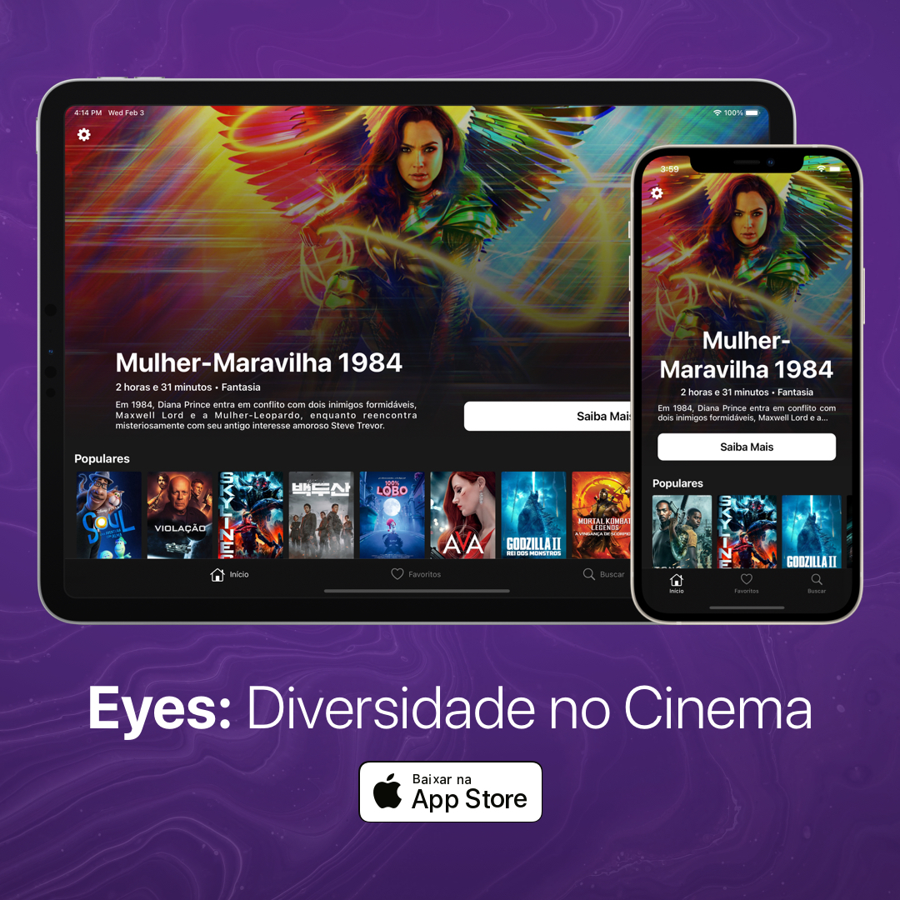

# Eyes: Diversity in Movies

Looking for movie suggestions that value female representativeness in films?
Perfect! Now you have Eyes.

With Eyes, you can see movies trending on your region for you to reflect on, evaluate and indicate the ones that represent women both in casting and scripting. With Eyes installed on your iPhone, you have access to all these features at any moment:

• The movie list is refreshed every week from the TMDb API. Browse and search the most valued productions.

• The more you browse, more information and knowledge you’ll obtain from the trending movies.

• Enjoy the tag system on the movies to think about them, and even share to other people!

• In a one stage quiz, evaluate whether a movie is approved on Bechdel Test or not.

Keep your eyes open to the female talents that deserve prominence with Eyes.
